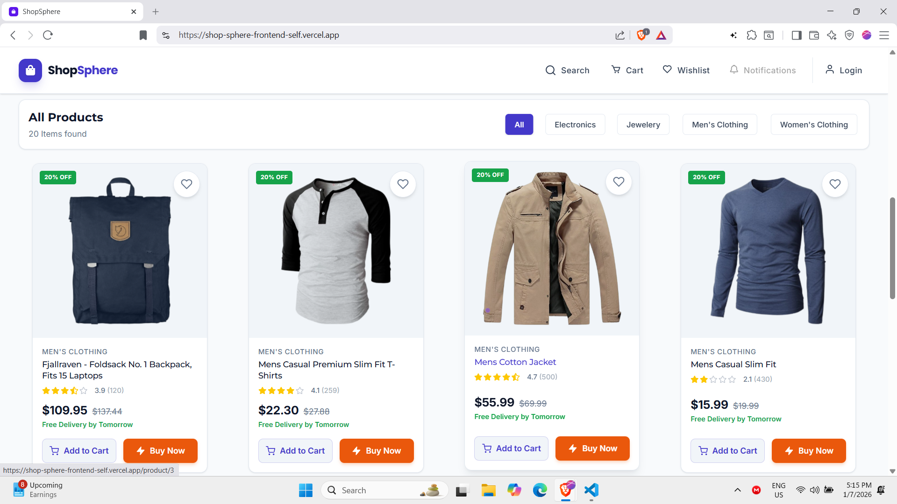
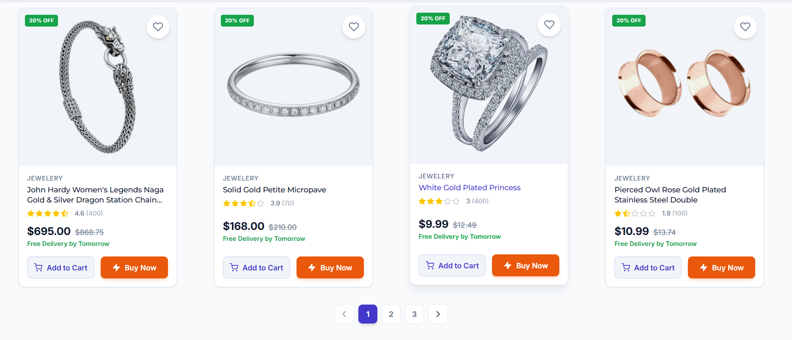
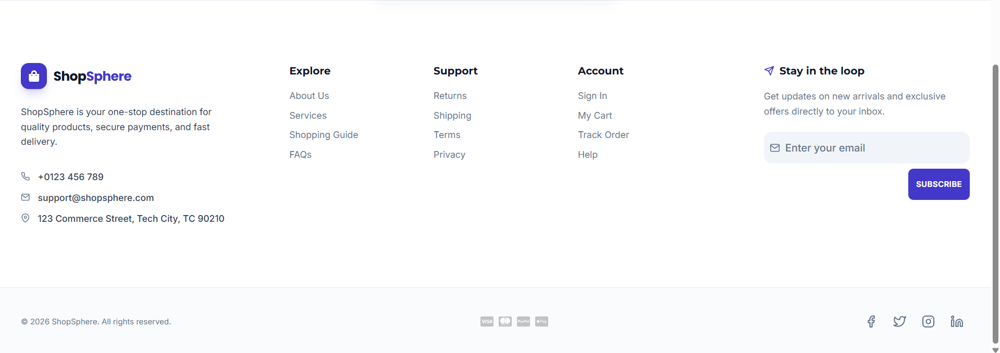
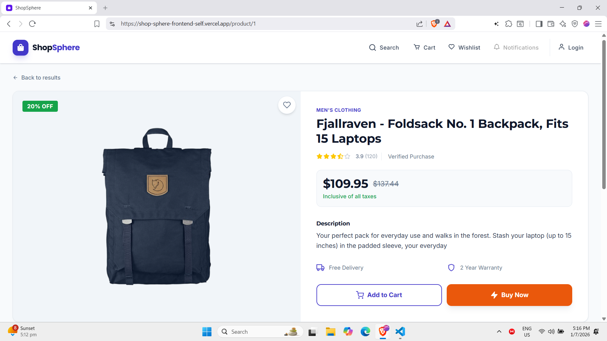
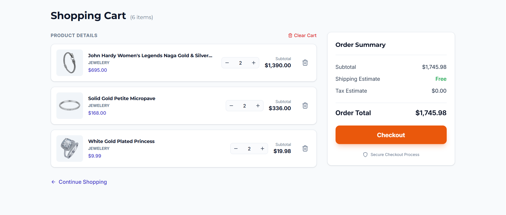
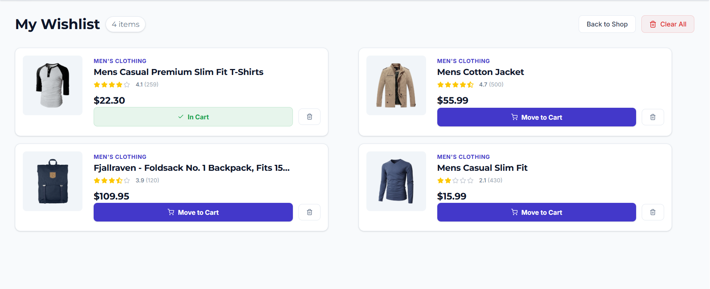
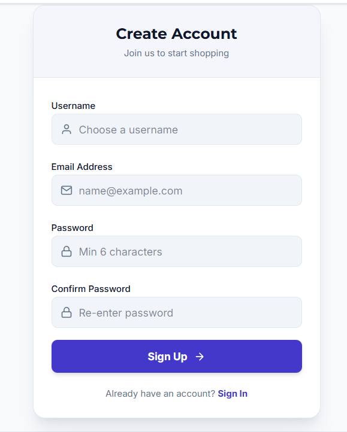
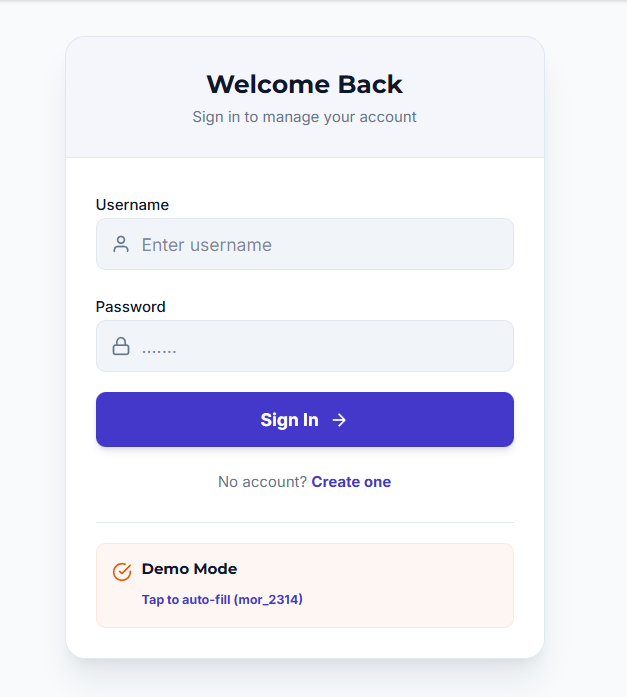

# 🛒 ShopSphere — Modern E-Commerce Frontend

**ShopSphere** is a modern, responsive, and feature-rich e-commerce frontend application built with **React 19**, **TypeScript**, and **Redux Toolkit**, focusing on clean architecture, scalable state management, and polished user experience.

> A production-grade shopping experience featuring product discovery, cart & wishlist management, authentication flows, and smooth UI animations — powered by FakeStore API.

**Status**: Frontend-only (API-driven)
**Architecture**: Component-driven, Redux-managed
**UI Philosophy**: Performance-focused, responsive, animation-enhanced.

## 📌 Project Overview

**ShopSphere** is a fully responsive, modern e-commerce frontend application designed to simulate a real-world online shopping experience. The application emphasizes **clean architecture**, **predictable state management**, and **high-quality user experience**, making it suitable for production-grade frontend systems, portfolios, and scalable extensions.

The project is built using **React 19** and **TypeScript**, with **Redux Toolkit** handling global state for products, cart, wishlist, and authentication. It integrates with the **FakeStore API** to fetch real product data while simulating authentication and persistence using browser storage.

### 🎯 Core User Flows

* **Product Discovery**

  * Browse all products

  * Filter by category

  * Search globally with URL-synced queries

  * Paginated product listing

* **Product Interaction**

  * View detailed product information

  * Add/remove products from cart

  * Add/remove products from wishlist

* **Cart Management**

  * Quantity control with real-time price updates

  * Persistent cart state using LocalStorage

  * Order summary with subtotal calculation

* **Wishlist Management**

  * Save products for later

  * Move items from wishlist to cart

  * Persistent wishlist state

* **Authentication (Simulated)**

  * Login using FakeStore API

  * Registration flow simulation

  * Token-based session persistence

### 🧩 Application Scope

* **Frontend-only application**

* **No custom backend** (uses FakeStore API)

* **Authentication and checkout are simulated**

* **State persistence handled via LocalStorage**

The application is structured to closely resemble how a real e-commerce frontend would be built in a production environment, with clear separation of concerns, reusable UI components, and scalable state logic.

## 🚀 Live Demo

Experience the application live in production:

🔗 **Live URL**: [https://shop-sphere-frontend-self.vercel.app/](https://shop-sphere-frontend-self.vercel.app/)

The deployed version reflects the latest stable build, including product browsing, cart and wishlist persistence, authentication flows, and responsive UI behavior.

### 🏠 Home Page

#### Hero Banner


#### Featured-Product


#### 🛍️ Product Listing & Category Filtering




#### 🧾 Footer Section



### 📄 Product Detail Page



### 🛒 Cart Management



### ❤️ Wishlist Page



### 🔐 Authentication (Login / Signup)

#### SignUP



#### Login



## 🧰 Tech Stack & Tooling

ShopSphere is built using a modern, production-ready frontend stack with an emphasis on scalability, maintainability, and developer experience.

### ⚛️ Frontend Framework

* **React (v19)**

  * Component-driven architecture

  * Functional components with hooks

  * Optimized rendering and state-driven UI updates

* **TypeScript**

  * Strong static typing across components, hooks, Redux slices, and services

  * Improved code reliability and maintainability

  * Explicit domain models for products, cart, wishlist, and authentication

### 🧠 State Management

* **Redux Toolkit**

  * Centralized global state for:

    * Products

    * Cart

    * Wishlist

    * Authentication

  * Async state handling via createAsyncThunk

  * Slice-based architecture for clear separation of concerns

* **React Redux**

  * Typed hooks for useDispatch and useSelector

  * Predictable and debuggable state flow

### 🌐 Routing

* **React Router**

  * Client-side routing with nested layouts

  * Dynamic routes for product details

  * URL-synced search and pagination

  * Graceful 404 (Not Found) handling

### 🎨 Styling & UI

* **Tailwind CSS**

  * Utility-first styling approach

  * Responsive design across breakpoints

  * Design-token–driven color system and typography

  * Consistent spacing, borders, and shadows

* **clsx + tailwind-merge**

  * Conditional class handling

  * Conflict-free Tailwind class merging via cn() utility

### 🎞️ Animations & Interactions

* **Framer Motion**

  * Page and component-level animations

  * Banner carousel transitions

  * Wishlist and cart item animations

  * Smooth entrance/exit and hover effects

### 🧩 UI Components & Icons

* **Reusable Component System**

  * Cards, buttons, badges, pagination, skeleton loaders

  * Auth layouts and form inputs

  * Shared primitives (IconBadge, SliderButton, SocialButton)

* **React Icons**

  * Consistent iconography across UI

  * Lightweight and tree-shakable icons

### 🔐 Authentication (Simulated)

* **FakeStore API**

  * Login via real API endpoint

  * Registration simulated for UX completeness

* **LocalStorage**

  * Token persistence

  * Session restoration on reload

### 🛒 Data & Persistence

* **Axios**

  * API abstraction layer

  * Centralized request handling

* **LocalStorage**

  * Persistent cart state

  * Wishlist persistence

  * Auth token storage

### 🚀 Deployment

* **Vercel**

  * Production deployment

  * Fast global CDN

  * CI/CD-ready frontend hosting

## 🗂️ Project Structure & Folder Organization

The ShopSphere codebase follows a feature-driven, scalable folder structure, separating concerns across UI components, state management, services, and utilities. This organization supports long-term maintainability and team collaboration.

### 📁 High-Level Structure

```text
src/
├── components/
│   ├── auth/              # Authentication UI (Login / Signup)
│   ├── cart/              # Cart UI components
│   ├── common/            # Shared reusable components
│   ├── dashboard/         # Home / Banner / Features
│   ├── product/           # Product-related UI
│   ├── ui/                # Design-system primitives
│   └── wishlist/          # Wishlist UI components
│
├── constants/             # Static configuration & UI data
│   ├── featuresData.ts
│   ├── footerData.ts
│   ├── navigation.ts
│   ├── paymentMethod.ts
│   └── socialLinks.ts
│
├── pages/                 # Route-level pages
│   ├── Cart.tsx
│   ├── Dashboard.tsx
│   ├── Login.tsx
│   ├── ProductDetail.tsx
│   ├── Wishlist.tsx
│   └── NotFound.tsx
│
├── services/              # API abstraction layer
│   └── api.ts
│
├── store/                 # Redux Toolkit store
│   ├── slices/
│   │   ├── authSlice.ts
│   │   ├── cartSlice.ts
│   │   ├── productSlice.ts
│   │   └── wishlistSlice.ts
│   └── index.ts
│
├── types/                 # Domain models & shared types
│   ├── auth.types.ts
│   ├── cart.types.ts
│   ├── product.types.ts
│   └── wishlist.types.ts
│
├── utils/                 # Utility helpers
│   ├── cn.ts
│   └── formateCurrency.ts
│
├── App.tsx                # Application root
├── main.tsx               # Entry point
└── index.css              # Global styles
```

### 🧩 Architectural Breakdown

#### **components/**

* Feature-based grouping (product, cart, wishlist, auth)

* Encourages reusability and separation of UI concerns

* Shared primitives live in ui/ and common/

#### **pages/**

* Route-level components only

* Responsible for orchestration, not UI primitives

* Keeps routing logic clean and predictable

#### **store/**

* Centralized Redux Toolkit configuration

* Each slice owns its domain logic and persistence

* Async operations handled via createAsyncThunk

#### **services/**

* Clean API abstraction

* Decouples UI from backend logic

* Easy to replace FakeStore API with a real backend

#### **types/**

* Strongly typed domain models

* Prevents prop drilling errors

* Enables IDE-level safety and refactoring

#### **utils/**

* Small, focused helpers

* Shared across UI and state layers

* Prevents duplication and styling conflicts

### 📐 Design Principles Followed

* **Single Responsibility**

* **Feature-first grouping**

* **Clear separation of concerns**

* **Scalable Redux architecture**

* **Production-grade readability**

✨ Key Features Breakdown
------------------------

ShopSphere implements a complete set of e-commerce features with attention to **real-world UX**, **state consistency**, and **scalable logic patterns**.

### 🏠 Home & Banner System

* Full-width animated hero banner

* Auto-playing carousel with:

  * Swipe/drag support

  * Direction-aware transitions

  * Pause-on-interaction behavior

* Layered design:

  * Animated background blur

  * Content + product imagery

* Custom pagination with progress indicators

**Key Concepts Used**

* Framer Motion variants

* Custom banner logic hook

* Controlled autoplay lifecycle

### 🛍️ Product Discovery

* Fetch products dynamically from FakeStore API

* Category-based filtering

* Global search with URL synchronization

* Client-side pagination

* Skeleton loaders during data fetch

**UX Enhancements**

* URL-driven state (search & page)

* Smooth scroll-to-results

* Empty-state handling

### 📄 Product Detail Experience

* High-resolution product gallery

* Dynamic pricing with simulated discounts

* Rating visualization with counts

* Trust indicators (delivery, warranty)

* Context-aware action buttons

**Behavior**

* Smart product resolution:

  * Uses cached product when available

  * Falls back to API fetch when needed

* Scroll reset on page entry

### 🛒 Cart Management

* Add-to-cart (single-instance logic)

* Quantity control:

  * Increment / decrement

  * Manual numeric input with validation

* Real-time subtotal calculation

* Persistent cart state via LocalStorage

* Order summary with totals

**State Strategy**

* Cart items normalized in Redux

* Totals derived via reducer logic

* LocalStorage sync on every mutation

### ❤️ Wishlist Management

* Add/remove wishlist items

* Persistent wishlist across sessions

* Move-to-cart functionality

* Animated list transitions

* Clear-all capability

**UX Details**

* Context-aware buttons (In Cart vs Move to Cart)

* Empty-state guidance

* Motion-based entry/exit animations

### 🔐 Authentication Flow (Simulated)

* Login via FakeStore API

* Registration flow simulation

* Token-based session handling

* Auth state persistence

* Protected user experience cues

**Developer Notes**

* Auth slice manages lifecycle states

* LocalStorage used for token/session recovery

* Clear separation of auth UI and logic

### 🎨 UI & Interaction Design

* Fully responsive layouts

* Utility-first Tailwind styling

* Reusable UI primitives

* Motion-enhanced interactions

* Accessible controls and labels

### 🧠 State & Data Handling

* Redux Toolkit slices per domain

* Async data fetching via thunks

* Predictable state transitions

* Strong TypeScript typing across layers

## ⚙️ Environment Setup

### Prerequisites

- Node.js ≥ 18
* npm or yarn
* Git

### Installation

```bash
git clone https://github.com/your-username/shop-sphere-frontend.git
cd shop-sphere-frontend
npm install
```

### Run Locally

```bash
npm run dev
```

#### App runs at

```ardino
http://localhost:5173
```

### Demo Credentials (FakeStore API)

```txt
Username: mor_2314
Password: 83r5^_
```

No .env file is required.

🔌 API Integration & Data Flow
------------------------------

* **API Provider**: FakeStore API

* **HTTP Client**: Axios

* **Async Handling**: Redux Toolkit createAsyncThunk

### Data Flow

1. UI dispatches async thunk

2. API call executed in services/api.ts

3. Redux slice updates lifecycle state

4. UI re-renders via selectors
